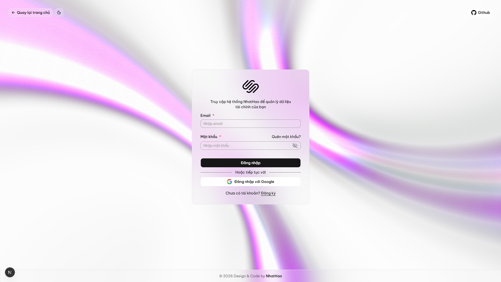
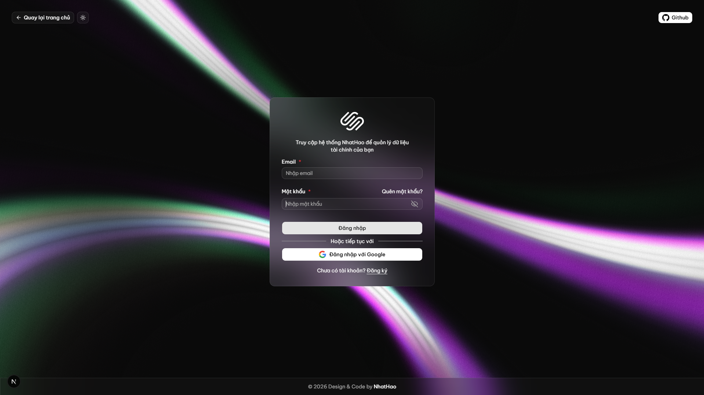

# 🛡️ Advanced Authentication System (Authentication)

Hệ thống xác thực toàn diện, bảo mật và hiện đại được xây dựng bằng **Next.js 15+**, **React 19** và **Tailwind CSS 4**. Dự án này cung cấp một quy trình xác thực người dùng hoàn chỉnh từ Đăng ký, OTP, Đăng nhập đến Quên mật khẩu với trải nghiệm người dùng cao cấp.

> [!IMPORTANT]
> **Backend Repository:** [NhatHaoDev3324/goAuth](https://github.com/NhatHaoDev3324/goAuth)
> 
> Hệ thống được thiết kế theo kiến trúc Microservices/Separation of concerns, kết nối Frontend qua API Golang hiệu năng cao.

---

## 📸 Giao diện ứng dụng (Screenshots)

### 🌓 Đăng nhập và Chế độ giao diện
Cung cấp trải nghiệm thị giác tuyệt vời với sự hỗ trợ của Next Themes và Tailwind CSS 4.

| Giao diện Sáng (Light Mode) | Giao diện Tối (Dark Mode) |
| :---: | :---: |
|  |  |

---

## ✨ Tính năng nổi bật & Cập nhật mới nhất

- 🔐 **Xác thực đa phương thức hoàn chỉnh**: 
  - **Đăng ký/Đăng nhập**: Xử lý logic nghiệp vụ phức tạp với backend Golang.
  - **Google OAuth 2.0**: Đăng nhập nhanh chóng, tự động đồng bộ hóa thông tin người dùng.
  - **Xác thực OTP (3-3 Grouping)**: Dialog OTP chuyên nghiệp tích hợp `input-otp`, hỗ trợ bộ đếm ngược (resend code) mượt mà.
- 🛣️ **Dynamic Routing Architecture**: Sử dụng [app/(auth)/[route]/page.tsx](file:///d:/myProject/Auth/auth/app/%28auth%29/%5Broute%5D/page.tsx) để quản lý tập trung toàn bộ các luồng xác thực, giảm mã lặp.
- 🌓 **Hệ thống Theme thông minh**: 
  - Component `LogoTheme` tự động chuyển đổi định dạng SVG dựa trên theme người dùng.
  - Chuyển đổi theme tức thời không gây giật lag (Zero flash of unstyled content).
- 🎨 **Visual & UX Excellence**:
  - **ColorBends Background**: Hiệu ứng nền chuyển động premium.
  - **Sonner Notifications**: Hệ thống thông báo toast hiện đại.
  - **Bảo mật**: Axios Interceptors tự động đính kèm token và xử lý đăng xuất khi token hết hạn.
- 📦 **State Management**: Zustand quản lý tập trung `userID`, `userName`, `email`, và `avatar`.
- 📧 **Email xác thực OTP chuyên nghiệp**: Hệ thống gửi email với mã OTP 6 chữ số được thiết kế hiện đại, đồng bộ hóa với Backend Golang.

---

## 🛠️ Công nghệ sử dụng (Tech Stack)

| Thành phần | Công nghệ |
| :--- | :--- |
| **Frontend Framework** | Next.js 15.2 (Turbopack) |
| **Library** | React 19 |
| **Styling** | Tailwind CSS 4.0 |
| **State Management** | Zustand |
| **UI Components** | Shadcn UI, Radix UI |
| **OTP Input** | `input-otp` |
| **API Client** | Axios |

---

## 📁 Cấu trúc thư mục (Project Structure)

```text
auth/
├── api/                # Các file định nghĩa gọi API (auth.ts - register, login, v.v...)
├── app/
│   ├── (auth)/         # Group route dành cho xác thực
│   │   └── [route]/    # Xử lý dynamic route cho Sign-in, Sign-up, Reset-pass
│   ├── layout.tsx      # Root layout & Metadata
│   └── page.tsx        # Dashboard (Yêu cầu login)
├── components/
│   ├── customs/        # Components tùy chỉnh: LogoTheme, DialogVerifyOTP, ColorBends
│   ├── forms/          # Logic xử lý các loại Form xác thực
│   └── ui/             # Shadcn-based UI components
├── store/              # Zustand Auth Store (quản lý state đăng nhập)
├── lib/                # Cấu hình Axios & Utils chuyên biệt
└── public/             # Assets chuyên dụng & README Images
```

---

## 🚀 Hướng dẫn cài đặt

1. **Khởi chạy Backend**: 
   Bạn cần cài đặt và chạy server tại [goAuth](https://github.com/NhatHaoDev3324/goAuth) trước.

2. **Clone & Cài đặt Frontend**:
   ```bash
   git clone https://github.com/NhatHaoDev3324/auth-fe.git
   cd auth-fe
   npm install
   ```

3. **Cấu hình môi trường** (`.env`):
   ```env
   NEXT_PUBLIC_API_URL=http://localhost:8080
   NEXT_PUBLIC_GOOGLE_CLIENT_ID=your_id.apps.googleusercontent.com
   ```

4. **Chạy dự án**:
   ```bash
   npm run dev
   ```

---

Dự án được phát triển và duy trì bởi **NhatHaoDev3324** 🚀

